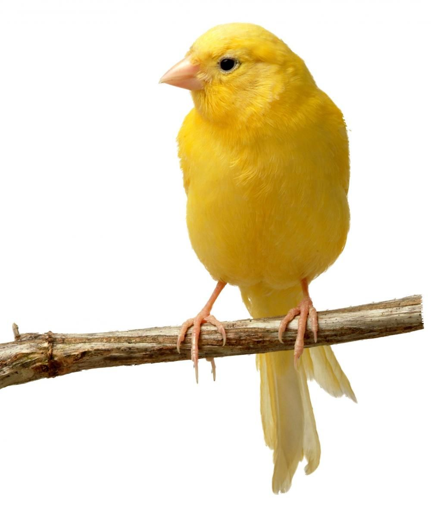

# header 1
## header 2
### header 3
#### header 4
##### header 5
###### header 6


1. aaaaaaa
    * aaa
    * aaa
    * aaa
1. aaaaaaa 
1. aaaaaaa 
---
***AAAAAAAAAAAAAAAAAAAAA***  
**BBBBBBBBBBBBBBBBBB**  
```
print('Hello world!)
```
>Какая то цитата

[Ссылка](https://google.com)



картинка-ссылка
[](https://google.com)

head|head|head
:---|:--:|:---
val |val|val